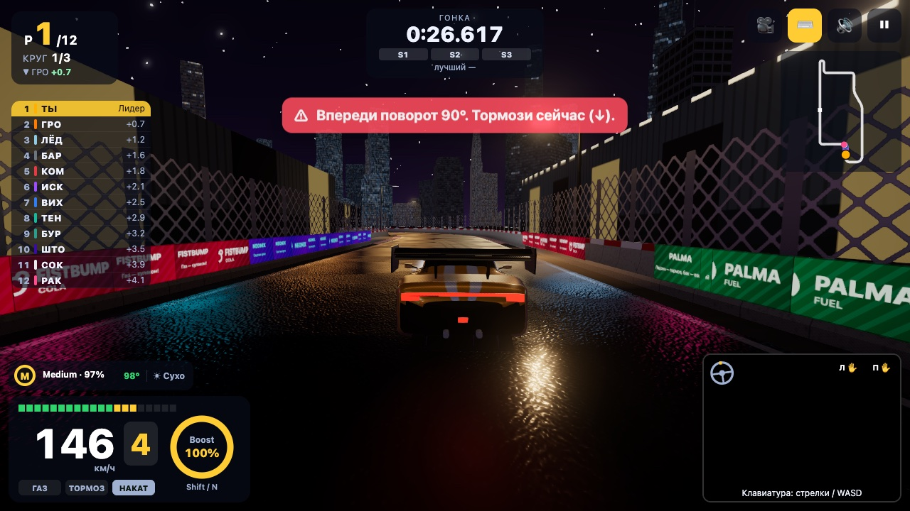
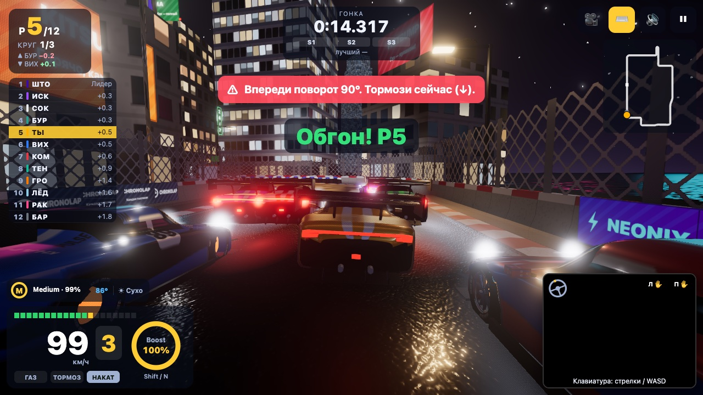
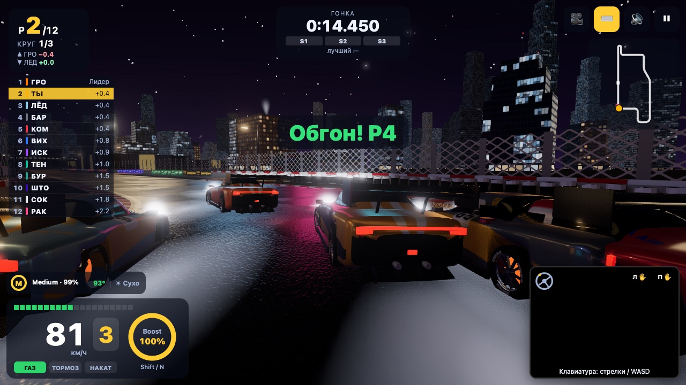
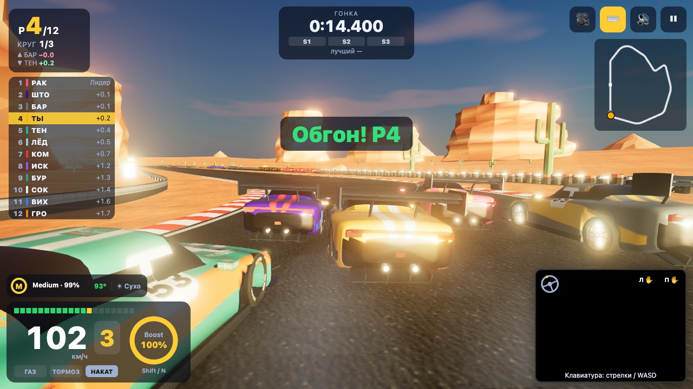
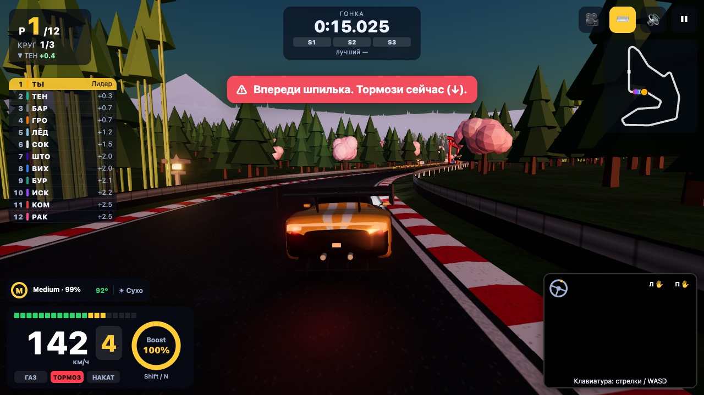
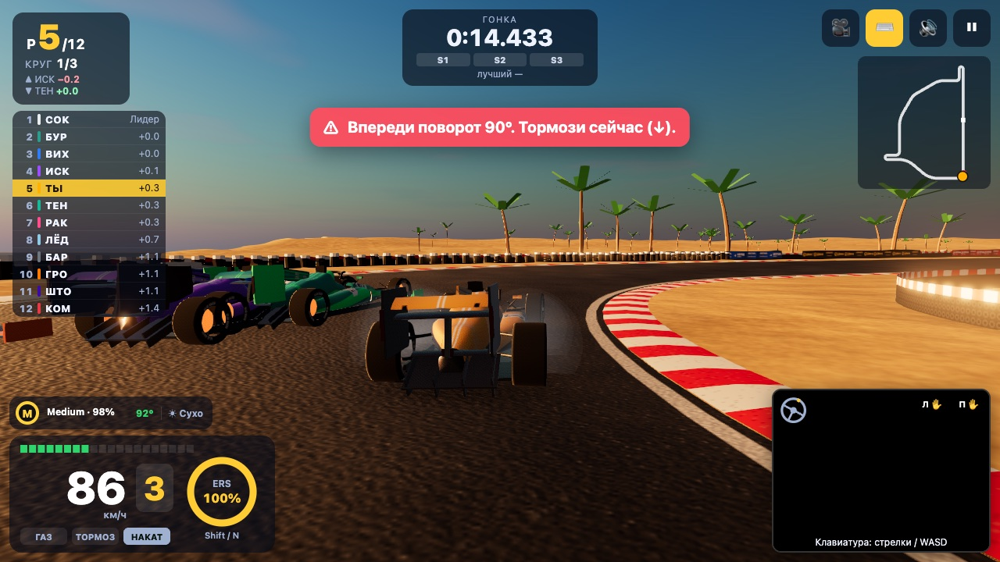
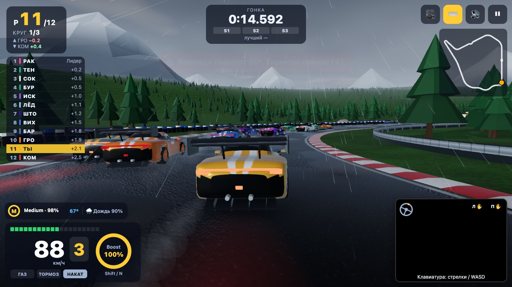
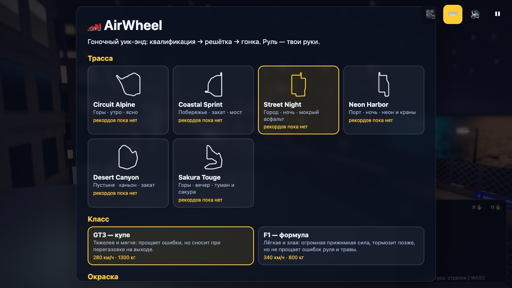
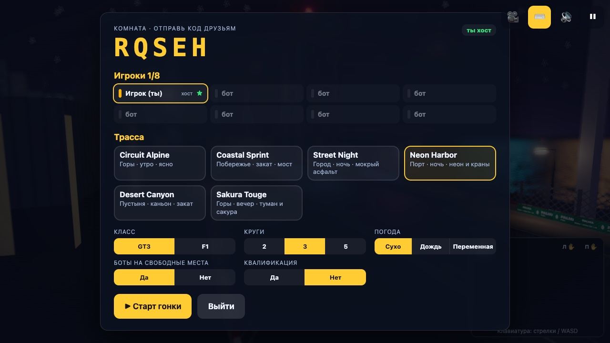
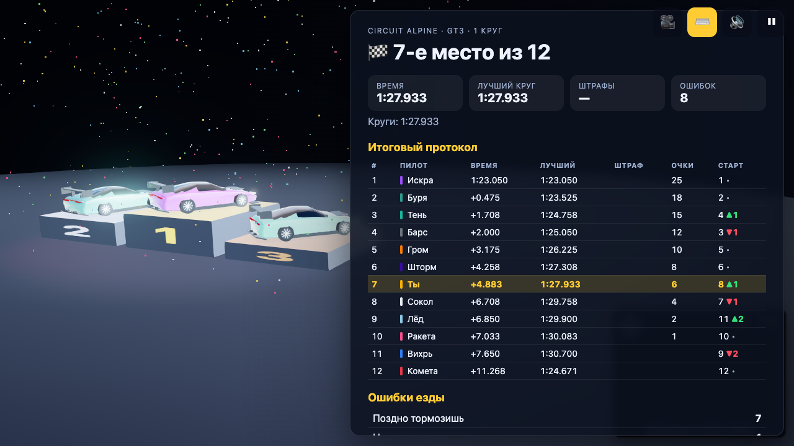

# 🏎️ AirWheel — руль из воздуха

3D-гонка, в которой машиной управляешь **руками через веб-камеру**, как настоящим рулём.
Гоночный уик-энд: квалификация → стартовая решётка → гонка на 12 машин → протокол и подиум.
Два класса (GT3 и F1), **шесть трасс**, **погода** (сухо / дождь / переменная), **шины и пит-стопы**,
**мультиплеер по коду комнаты** (до 8 игроков, без своего сервера). Никаких контроллеров и установок:
всё работает в браузере, все модели и текстуры генерируются кодом.

**Кейс:** «Motion. Камера вместо джойстика» · **Направление:** FREE / GAME



| Street Night — город ночью | Neon Harbor — порт и краны |
|---|---|
|  |  |
| **Desert Canyon — каньон на закате** | **Sakura Touge — серпантин вечером** |
|  |  |
| **Coastal Sprint — F1 у моря** | **Circuit Alpine — дождь, пасмурное небо** |
|  |  |
| **Меню: шесть трасс, погода, шины, окраска** | **Мультиплеер: комната по коду** |
|  |  |
| **Онбординг: камера и свет → калибровка руля → обучение** | **Итоги и подиум** |
|  |  |

**Деплой:** _ссылка появится после публикации (см. раздел «Деплой»)_

---

## Как запустить локально

```bash
npm i          # заодно копирует WASM MediaPipe в public/wasm
npm run dev    # http://localhost:5173
```

```bash
npm run build       # сборка в dist/
npm run preview     # проверить сборку локально
npm test            # тесты жестов и коуча, физики, трасс, шин, пит-стопов, ботов, гонки и сети
npm run build:cars  # пересобрать модели машин (public/models/cars/*.glb) из процедурного генератора
```

Камера в браузере работает только на `https://` или `localhost`. Без камеры можно играть с клавиатуры:
кнопка ⌨️ или клавиша `K`; при отказе камеры режим включается сам. На телефоне в клавиатурном режиме
появляются тач-кнопки (◀ ▶ ⚡ тормоз газ). Одиночная игра всегда работает без сети.

Параметры адреса для быстрой проверки: `?track=alpine|coastal|street|harbor|desert|sakura`,
`?class=gt3|f1`, `?laps=1`, `?weather=dry|rain|variable`, `?graphics=low|medium|high`,
`?autopilot` — машину ведёт автопилот (проверка без камеры).

---

## Жесты и действия

| Жест | Что показать | Действие |
|---|---|---|
| ✊✊ | Обе руки сжаты в кулаки | **Газ** (нарастает за 0,2 с); в боксе после смены шин — **выезд** |
| ✋✋ | Обе ладони открыты | **Тормоз** (с ABS); стоя на месте > 0,6 с — задний ход |
| ✊✋ | Одна рука кулак, другая ладонь | **Накат** + подсказка |
| ↻ | Наклон линии между руками, как у руля | **Поворот** (±5° мёртвая зона, ±45° — максимум) |
| 👍 | Большой палец вверх на любой руке 0,3 с | **Boost** (GT3) / **ERS** (F1); в окне пит-стопа — **выбор шин** (Soft → Medium → Мокрые → отмена) |
| 🙌 | Обе открытые ладони подняты к камере 1 с | **Старт / продолжить** (меню, лобби, протокол квалы, пауза, итоги) |

Клавиатура: `↑`/`W` газ, `↓`/`S` тормоз, `←` `→`/`A` `D` руль, `Shift`/`N` ускорение, `C` камера,
`Esc`/`P` пауза, `M` звук, `K` камера/клавиатура, `1`/`2`/`3` — заказать в боксе Soft/Medium/Мокрые,
`0` — отменить заезд. `` ` `` — отладочная панель (FPS, draw calls), `F3` — подробная (физика по колёсам).

---

## Гоночный уик-энд

`МЕНЮ → КВАЛИФИКАЦИЯ → РЕШЁТКА → ГОНКА → ИТОГИ` ([`session.js`](src/game/session.js), [`quali.js`](src/game/quali.js))

1. **Меню** — трасса (с контуром и твоим рекордом), класс GT3/F1, окраска машины (8 ливрей), 2/3/5 кругов,
   **погода** (Сухо / Дождь / Переменная), **стартовые шины**, помощь рулём, сила соперников, пресет графики,
   кнопка **«👥 Мультиплеер»**. Настройки сохраняются.
2. **Квалификация** — ты один на трассе, **две попытки** быстрого круга. Сектора S1/S2/S3, дельта к лучшему
   кругу. Время ботов зависит от их мастерства и влажности трассы. Срезка аннулирует круг.
3. **Решётка** — по итогам квалы, панорама камеры с глубиной резкости, **5 красных огней**, случайная пауза.
   Сдвинулся раньше — **фальстарт +5 с**.
4. **Гонка** — 12 машин. Позиция, круг, разрывы, башня лидеров, мини-карта, шины и их износ, погода,
   окно пит-стопа. Штрафы: удар о стену +2 с, **срезка** (все 4 колеса за линией > 1 с) +3 с,
   **превышение 60 км/ч в пит-лейне** +3 с, автоматический возврат на трассу +2 с.
5. **Итоги** — протокол с временем, лучшим кругом, штрафами, **пит-стопами и потерями в боксах**,
   очки 25-18-15-12-10-8-6-4-2-1, 3D-подиум, ошибки коуча и главная ошибка заезда.

---

## Трассы

Каждая трасса — данные ([`src/game/tracks/`](src/game/tracks)): раскладка «прямые + дуги» → замкнутый
сплайн, профили ширины, высоты, наклона и вылетов, повороты, пит-лейн, окружение. На каждой — не меньше
трёх поворотов под тормоз, длинная прямая, пит-лейн у старта, стартовый портал с огнями, зона DRS
и тормозные таблички 100/50 м.

| Трасса | Длина, ширина | Время круга GT3 / F1* | Характер |
|---|---|---|---|
| **Circuit Alpine** — горы, утро | 3,2 км, 12–14 м | 1:07 / 0:50 | плавные дуги, подъём в эсках, спуск по длинной прямой в **шпильку**, **шикана**; ельник, снежные вершины, трибуны |
| **Coastal Sprint** — побережье, закат | 3,7 км, 12,5–15 м | 1:19 / 1:02 | прямая вдоль моря и **90°** после неё, **две шпильки**, **мост над лагуной**; пальмы, дюны, песок в зонах вылета |
| **Street Night** — город, ночь | 3,7 км, 8–11 м | 1:35 / 1:17 | узкие улицы, **бетонные стены вплотную**, **туннель**, **шпилька 180°**, семь поворотов 90°; LED-экраны, неон, гирлянды, мокрый асфальт |
| **Neon Harbor** — порт, ночь | 3,25 км, 11–13,5 м | 1:16 / 0:59 | **800 м вдоль причала**, контейнерный терминал, обратная прямая под **портальными кранами** и эстакадой, **шпилька на пирсе** |
| **Desert Canyon** — пустыня, закат | 3,5 км, 13–15 м | 1:07 / 0:48 | длинная прямая через пески, подъём в **красный каньон**, быстрые дуги, перепады высот, арка из скал |
| **Sakura Touge** — горный серпантин, вечер | 3,0 км, 9,5–11,5 м | 1:21 / 1:04 | **три шпильки** и перевал, кедры, бамбук, сакура, **тории над дорогой**, каменные фонари |

\* Идеальный круг по профилю скорости на сухом асфальте; живой игрок обычно на 5–15% медленнее.

---

## Физика

[`physics.js`](src/game/physics.js), фиксированный шаг **120 Гц** отдельно от рендера, с интерполяцией.

- **Модель шины на каждое колесо**: упрощённая Magic Formula `sin(C·atan(B·α))` — пик бокового сцепления
  при угле увода **6–8°**, дальше падение до 80–85%; **круг трения** (тормоз/газ «съедают» боковое
  сцепление); перенос веса вперёд/назад и с борта на борт; чувствительность шины к нагрузке.
- **Руль зависит от скорости**: от ~30° на месте до 3–5° на максималке (предел сцепления + запас),
  сглаживание ввода и ограничение скорости поворота — дрожь рук не превращается в рывки.
- **TC** (проскальзывание ~0,15, газ возвращается за 0,25 с), **ABS** с приоритетом бокового сцепления,
  **ESP** по ошибке рыскания. **Помощь рулём**: выкл / низкая / **средняя (по умолчанию)** / высокая.
  На малой скорости гасится боковое скольжение (машина не «плавает» на месте).
- **Покрытия под каждым колесом** ([`surfaces.js`](src/game/surfaces.js)), сцепление усредняется по колёсам:

  | Покрытие | Сцепление | Замедление | Что ещё |
  |---|---|---|---|
  | асфальт, пит-лейн | 100% | — | |
  | поребрик | 95% | слабое | вибрация камеры и руля, звук |
  | зона вылета (город) | 90% | слабое | |
  | трава | 65% | ~14 км/ч в секунду на скорости, мягкий предел | с места выехать можно всегда |
  | гравий, песок | 50% | сильное | пыль, тряска |

- **Удар о стену**: скорость раскладывается на нормальную и касательную части. Отскок 0,2–0,3; касательная
  теряет 10–25% в зависимости от угла: по касательной (< 15°) почти без потерь, в лоб — большая часть
  скорости, но не вся. Ограниченный импульс вращения, выталкивание вдоль нормали, 0,5 с пониженного
  сцепления, 0,15 с между ударами; тряска, искры и звук — по силе удара.
- **Столкновения машин** — мягкий обмен импульсом по OBB с учётом масс (импульс ограничен, никого не «выстреливает»).
- **Автовозврат**: стоишь медленнее 5 км/ч дольше 4 с вне трассы, в стене или задом наперёд — машина
  возвращается на трассу, **+2 с**.
- Проверено тестом «водитель-жест»: автопилот с задержкой 80 мс, шумом руля и газом «вкл/выкл», как у рук,
  проходит GT3 без помощи с 2–3 ошибками за круг; F1 строже, но тоже проходит.

## Классы машин

Файл [`src/game/cars.js`](src/game/cars.js) — только данные, физика и боты читают всё оттуда.

| | GT3 | F1 |
|---|---|---|
| Масса / мощность | 1300 кг / ~404 кВт | 800 кг / ~750 кВт |
| Макс. скорость | ~280 км/ч | ~340 км/ч |
| Прижимная сила (∝ v²) | умеренная | ~2,6 веса на максималке |
| Шины | пик увода 8° (перед) / 6,5° (зад), мягкий срыв | пик 6,5° / 5,5°, острее и строже |
| Помощь | TC и ESP сильнее, запас задней оси больше | TC слабее, ошибки руля и травы не прощаются |
| Передачи, ускорение | 6, Boost +22% на 3 с | 8, ERS +21% на 4 с, заряд при торможении |

---

## Шины, погода и пит-стопы

[`tires.js`](src/game/tires.js), [`weather.js`](src/game/weather.js), [`pit.js`](src/game/pit.js)

**Составы** (виджет шин в HUD показывает состав, износ и температуру):

| Состав | Сухо | Мокро | Износ |
|---|---|---|---|
| **Soft** | 103,5% | 62% | быстрый; изношенная теряет до 24% |
| **Medium** | 100% | 65% | средний; до 16% |
| **Мокрые** | 85% | 90% | на сухом перегреваются и стираются в ~3 раза быстрее; до 20% |

Сухие шины в дождь держат 0,6–0,7, мокрые на сухом — ~0,85. Сцепление зависит ещё от температуры
(окно ±10° от рабочей).

**Погода** (выбор в меню или у хоста): **Сухо**, **Дождь**, **Переменная** — дождь начинается на 1–2 круге
и заканчивается во время гонки; за круг до него — предупреждение **«Дождь через 1 круг»**. Трасса намокает
за ~25 с и сохнет ~1,5 минуты, поэтому после дождя ещё круг-полтора выгоднее мокрые шины. Всё
детерминировано по seed — в мультиплеере дождь у всех начинается одновременно. В дождь: капли, брызги
из-под колёс, лужи с отражениями, пасмурное небо и приглушённый свет.

**Пит-лейн** у старта на каждой трассе: сужение въезда → линия **60 км/ч** → боксы на каждую машину → выезд.
1. На подъезде открывается **окно выбора шин** (жест 👍 листает составы, клавиши `1`/`2`/`3`, кнопки в HUD).
2. Заезжаешь в пит-лейн; на линии въезда скорость выше 65 км/ч — **+3 с** и подсказка коуча
   «Превышена скорость в пит-лейне. Раскрой ладони и притормози». В зоне ограничителя лишняя скорость гасится.
3. Останавливаешься у отметки своего бокса (с помощью рулём машину подводит сама) — механики меняют шины
   **2,5–4 с** (смена сухие ↔ мокрые дольше), кольцо прогресса.
4. ✊✊ — выезд. Время в боксах и потери — в протоколе.

**Боты** тоже меняют шины по стратегии: износ, дождь, сколько кругов осталось. Без «читов» по времени —
их потери в боксах сравнимы с потерями игрока.

---

## Мультиплеер по коду комнаты

[`src/net/`](src/net) — WebRTC P2P, **без своего сервера** (никакого бэкенда на Vercel, никаких аккаунтов).

- **Сигналинг** — [Trystero](https://github.com/dmotz/trystero) через публичные Nostr-релеи (список в
  [`transport.js`](src/net/transport.js)); дальше трафик идёт напрямую между браузерами.
  NAT: публичные STUN (Google, Cloudflare, Twilio) и бесплатный TURN Open Relay (Metered).
- **Лобби**: «Создать комнату» — код из **5 символов** (без O, 0, I, 1), «Войти» по коду, «Играть одному».
  Список игроков (имя, цвет, «готов»), до **8 игроков**, свободные места занимают боты.
  Хост выбирает трассу, класс, круги, погоду, квалификацию.
- **Поток**: квалификация (по желанию) → решётка → гонка → общий протокол.
- **Хост-авторитетная модель**: хост ведёт старт, время, ботов, погоду (seed) и итоговый протокол.
  Каждый клиент сам симулирует свою машину и **20 раз в секунду** шлёт состояние; хост рассылает снимок
  всех машин. Чужие машины рисуются с **буфером 100 мс** (интерполяция) и экстраполяцией до 250 мс.
  Часы синхронизируются по пингу, старт — по времени хоста. Мягкие столкновения между игроками.
  Пинг виден в лобби и в HUD.
- **Ошибки и отключения**: подключение дольше **10 с** — понятное сообщение по-русски и кнопки
  «Попробовать снова» / «Играть одному». Игрок отключился — его машину ведёт бот с того же места.
  Хост отключился — сообщение и выход в меню.

---

## Боты

[`bots.js`](src/game/bots.js) — 11 соперников того же класса.

- Едут по **гоночной траектории** минимальной кривизны; скорость — из собственного профиля торможения/разгона
  (мастерство × сила соперников), в дождь — по «мокрому» профилю с учётом шин.
- Характер: агрессивный или аккуратный — желание обгонять и частота ошибок.
- Тормозят за машиной впереди, обгоняют на прямых, мягко сталкиваются с игроком.
- Шины изнашиваются, стратегия пит-стопов — как у игрока.

---

## Режим «Ошибка» (коуч)

Файлы: [`coach.js`](src/control/coach.js) (правила и приоритеты), [`gestures.js`](src/control/gestures.js)
(ошибки рук), [`analyzer.js`](src/game/analyzer.js) (ошибки езды по данным трассы).

- **Одна подсказка за раз**, самая важная. Порядок: **безопасность → техника рук → освещение**.
- Подсказка держится минимум 1,5 с, но подсказка безопасности вытесняет другую сразу.
- Проблемная рука на скелете в превью камеры красная. Статистика → «главная ошибка заезда» в итогах.
- В клавиатурном режиме работают правила езды (с клавиатурными текстами).

**Полный список подсказок:**

| Приоритет | Ситуация | Подсказка |
|---|---|---|
| безопасность | Удар о стену | Ты задел стену. Держись ближе к центру трассы на узких участках. |
| | Через ~0,6 с скорость будет выше профиля торможения | Впереди шпилька (шикана, поворот 90°). Раскрой ладони и тормози сейчас. |
| | Газ, пока горят огни старта | Рано! Держи ладони раскрытыми, пока горят огни, — иначе фальстарт. |
| | Быстрее 65 км/ч на линии пит-лейна | Превышена скорость в пит-лейне. Раскрой ладони и притормози. |
| | В повороте с газом быстрее предела | Слишком быстро для поворота. Ладони раскрой раньше. |
| | Колёса на траве | Колёса на траве. Сбрось газ и вернись на асфальт плавно. |
| | Перед машины «уплыл», несёт наружу | Не довернул. Поверни руки сильнее и убери газ. |
| | Руль быстрее 2,4/с на скорости > 120 км/ч | Крутишь слишком резко на скорости. Поворачивай плавнее, иначе занос. |
| техника рук | Обе руки не видны (игра на паузе) | Обе руки пропали из кадра. Верни их в центр, на уровень груди. |
| | Одна рука не видна | Левая (правая) рука вышла из кадра. Верни её в центр. |
| | Запястье ниже 78% кадра | Руки слишком низко. Подними их на уровень груди, иначе руль не читается. |
| | Кулак + ладонь | Одна рука сжата, другая открыта. Сожми обе для газа или раскрой обе для тормоза. |
| | fist_score между 0,9 и 1,1 | Кулак сжат не до конца. Сожми крепче, чтобы газовать. |
| | Руки ближе 60% калибровки | Руки слишком близко. Разведи шире, руль будет точнее. |
| | Руки дальше 160% калибровки | Руки слишком далеко друг от друга. Сведи ближе. |
| | Угловая скорость руля > 250°/с | Крутишь слишком резко. Поворачивай плавнее. |
| | Руль 5–12° дольше 3 с на прямой | Руль уходит вбок. Выровняй руки по горизонтали. |
| | Тормоз на прямой без причины | Тормозишь на прямой. Сожми кулаки, чтобы ехать быстрее. |
| | Накат на свободной прямой | Газ не нажат на свободной прямой. Сожми оба кулака крепче. |
| | Палец вверх опущен раньше 0,3 с | Держи большой палец вверх дольше, пока не заполнится кольцо. |
| освещение | Яркость кадра < 55/255 | Слишком темно. Включи свет или повернись к окну. |

---

## Графика

Стилизованная, но плотная картинка в духе Slow Roads и современных браузерных гонок — при стабильных 60 FPS.

- **Машины** — glTF (meshopt), собранные процедурным генератором ([`tools/build-cars.mjs`](tools/build-cars.mjs),
  [`carGen.js`](src/render/carGen.js)): три LOD (~22k / ~5k / ~1k треугольников), PBR-лак с clearcoat,
  карбон, стекло, диски с тормозами (диски краснеют при торможении), рабочие фары, стоп-сигналы и
  дождевой огонь F1, **8 ливрей** с номерами и вымышленными спонсорами, крутятся колёса и работает подвеска.
- **Трасса**: асфальт с картами нормалей и шероховатости, износ в двух масштабах, резина на траектории,
  **следы торможения** перед поворотами, пятна масла; поребрики; отбойники **«Нью-Джерси»** с грязью у
  основания, armco, шинные стенки; **реклама вымышленных брендов** (один атлас): щиты на опорах с
  подсветкой и баннеры вдоль ограждения; стартовый портал с огнями, **табло-пилон с живыми позициями**;
  пит-лейн с боксами и механиками; посты маршалов, камеры, конусы, стопки шин, трибуны.
- **Город** (ночные трассы): здания разной формы (подиумы, ступенчатые башни, «короны») — одна геометрия,
  форма задаётся атрибутом экземпляра; **4 стиля фасадов** (жилой, офис, ленточное остекление, стекло)
  в массиве текстур; окна горят у каждого здания по-своему (в офисах — секциями этажей), витрины первых
  этажей; **LED-экраны** с роликами (смена в шейдере), **неоновые вывески**, гирлянды на проводах через улицу,
  пар из люков, кондиционеры и баки на крышах, вертолётные площадки, **мигающие авиаогни**, дальний силуэт
  города. Ни одного отдельного меша на окно — весь город около 20 draw calls.
- **Свет**: днём — небо `Sky` и environment map через PMREM; ночью — шейдерное небо со звёздами,
  «огни города» в отражениях. **Пул настоящих источников**: 10 / 5 / 2 по пресету у ближайших фонарей
  и экранов, остальные — emissive + bloom. Фара игрока — `SpotLight`, у соперников — пятна света на асфальте,
  **блики фар и стоп-сигналов**, **отражения стоп-сигналов на мокром асфальте**. Тени 2048 / 1024 / выкл.
- **Дождь**: капли, брызги, лужи (почти зеркальные), тёмный мокрый асфальт, пасмурный купол неба днём.
- **Постобработка**: Bloom, ACES, SMAA/FXAA, AO по глубине (на высоком, упрощённый на среднем), радиальное
  размытие на скорости (без размытия своей машины), глубина резкости только в меню и на решётке,
  виньетка и хроматическая аберрация.
- **Камера** за машиной: пружина по смещению, задержка поворота, FOV 60→85 от скорости, тряска от поребриков
  и ударов. Ещё: капот/кокпит и ТВ-камеры — `C` или 🎥.
- **Пресеты** ([`quality.js`](src/render/quality.js)): Низкая / Средняя / Высокая. **Авто**: если средний FPS
  ниже 45 за 3 с, пресет понижается.

**Производительность** (замер в Chrome, 1280×720, 12 машин, панель `` ` ``):

| | Низкая | Высокая |
|---|---|---|
| Draw calls в гонке | 55–85 | 95–180 (в дождь — до ~245) |
| Draw calls на решётке (все 12 машин в кадре) | 125–155 | 210–240 |
| Треугольники | 180–370 тыс. | 250 тыс. – 1,1 млн |

Распознавание рук идёт отдельно от рендера: 30 Гц (24 Гц на низком пресете), только на новых кадрах камеры.

## Звук

Web Audio, без файлов ([`audio.js`](src/game/audio.js)): двигатель из осцилляторов и шума по оборотам и
передаче (GT3 — низкий рык, F1 — высокий визг), визг шин и тормозов, ветер, поребрик, удары о стену,
ближайший соперник в стерео, сигналы огней старта, круга и финиша. Кнопка 🔊 / клавиша `M`.

---

## Как устроено распознавание

```
камера → HandLandmarker (21 точка × 2 руки) → gestures.js → {steer, gas, brake, nitro, handsVisible, fistL, fistR, errors[]} → игра
                                                  ↑ wheel.js (руль)      ↓ coach.js (подсказки) ← analyzer.js (ошибки езды)
```

Игровой слой (`src/game`) ничего не знает про MediaPipe: он получает только объект управления.
Клавиатура, тач-кнопки, автопилот и сеть работают с объектом того же формата.

- **MediaPipe HandLandmarker** (`@mediapipe/tasks-vision`), 2 руки, режим `VIDEO`, GPU с откатом на CPU.
  WASM и модель лежат в `public/` и грузятся с того же домена, без CDN.
- **Зеркалирование** и разбор левой/правой руки по x на экране, а не по метке handedness.
- **Сжатие руки:** `fist_score` = среднее расстояние от кончиков 4 пальцев до запястья / размер ладони;
  гистерезис 0,9 / 1,1. **One Euro Filter** сглаживает запястья и угол руля. **Калибровка** — «возьми руль» на 2 с.
- **Потеря руки:** пропуски до 150 мс игнорируются; одна рука пропала — руль плавно в 0, газ выключен;
  пропали обе — пауза.

---

## Структура

```
public/             wasm MediaPipe, models/hand_landmarker.task, models/cars/{gt3,f1}.glb
tools/              build-cars.mjs (генератор GLB машин), car-viewer.html
src/vision/         camera.js, hands.js, filters.js
src/control/        gestures.js, wheel.js, coach.js, keyboard.js
src/game/           cars.js, physics.js, surfaces.js, tires.js, weather.js, pit.js, track.js,
                    profile.js (траектория, профиль скорости), bots.js, session.js (гонка), quali.js,
                    timing.js, analyzer.js, autopilot.js, audio.js
src/game/tracks/    alpine, coastal, street, harbor, desert, sakura, turtle.js (раскладка), index.js
src/net/            transport.js (Trystero, коды комнат), netgame.js (лобби, синхронизация),
                    netsession.js (сетевая гонка), remote.js (интерполяция чужих машин)
src/render/         scene.js (рендер, небо, постобработка), world.js (трасса целиком, огни), trackMesh.js,
                    trackside.js (реклама и детали у трассы), city.js (город), scenery.js, scenery2.js
                    (порт, каньон, Япония), pitlane.js, terrain.js, rain.js, carGen.js, carModel.js,
                    cameras.js, particles.js, podium.js, quality.js, textures.js
src/ui/             hud.js, menu.js, lobby.js, results.js, onboarding.js, preview.js, leaderboard.js
src/main.js         стейт-машина уик-энда и главный цикл
tests/              coach.test.mjs, game.test.mjs, net.test.mjs
```

## Тесты

`npm test` — 56 проверок без браузера и камеры:
- **жесты и коуч** (22): распознавание на синтетических 21 точках руки, все подсказки, приоритеты и вытеснение;
- **игра** (29): все 6 трасс (замкнутость, ширина, ≥ 3 зоны торможения, пит-лейн, особенности); физика
  (скорости классов, удары о стену по углу, трава, гравий, автовозврат, TC/ABS, руль по скорости);
  «водитель-жест» без помощи; шины, износ и погода; пит-стоп игрока (60 км/ч, 2,5–4 с, смена шин,
  потери) и штраф за скорость в пит-лейне; пит-стопы ботов в «Переменной» погоде; боты, квалификация,
  полная гонка, автоподбор графики. Детерминированы: `Math.random` с фиксированным seed (`TEST_SEED`);
- **сеть** (5): коды комнат, кодирование состояния, интерполяция и экстраполяция, сетевая гонка
  «хост + клиент» в одном процессе с задержкой доставки, передача машины ушедшего игрока боту.

---

## Деплой

Сборка статическая (`dist/`), бэкенд не нужен — мультиплеер идёт напрямую между браузерами.

- **Vercel:** импортировать репозиторий, настройки подтянутся из `vercel.json`.
- **GitHub Pages:** *Pages → Source: GitHub Actions*, workflow [`.github/workflows/deploy.yml`](.github/workflows/deploy.yml)
  прогонит тесты, соберёт и опубликует сайт.
- **Netlify:** настройки подтянутся из `netlify.toml`.

В `vite.config.js` стоит `base: './'`, поэтому сборка работает и в подпапке.

---

## Лицензии и источники

**Все модели, текстуры, трассы и звуки сделаны кодом этого репозитория** — сторонних 3D-моделей,
текстур, шрифтов и звуков нет. Машины генерирует [`carGen.js`](src/render/carGen.js) (скрипт
`npm run build:cars` сохраняет их в GLB), текстуры (асфальт, фасады, реклама, неон, ливреи) рисуются на canvas
при загрузке. **Все бренды и спонсоры вымышленные** (AIRWHEEL, FISTBUMP COLA, TACHYON TYRES, PALMA FUEL,
NEONIX, GESTURA MOBILE, KITSUNE RAMEN, CHRONOLAP); любые совпадения случайны.

| Компонент | Для чего | Лицензия |
|---|---|---|
| [three.js](https://threejs.org) (+ examples: Sky, EffectComposer, Bloom, SMAA, FXAA, GLTFLoader/Exporter) | рендер | MIT |
| [@mediapipe/tasks-vision](https://developers.google.com/mediapipe) и модель `hand_landmarker.task` | точки рук | Apache-2.0 |
| [Trystero](https://github.com/dmotz/trystero) | WebRTC-сигналинг через Nostr | MIT |
| [meshoptimizer](https://github.com/zeux/meshoptimizer) | сжатие GLB и декодер | MIT |
| [glTF-Transform](https://gltf-transform.dev) | сборка GLB (только инструмент) | MIT |
| [Vite](https://vitejs.dev) | сборщик | MIT |

Сетевые сервисы (только для мультиплеера, без аккаунтов): публичные Nostr-релеи (nos.lol, relay.damus.io,
nostr.mom, relay.primal.net и др. — список в [`transport.js`](src/net/transport.js)), STUN-серверы
Google / Cloudflare / Twilio, бесплатный TURN [Open Relay](https://www.metered.ca/tools/openrelay/) (Metered).

---

## Что было сделано до старта хакатона

Ничего. Весь код написан во время хакатона, это видно по истории коммитов.
Из готового используются только библиотеки из таблицы выше.

---

## Известные ограничения

- Нужна веб-камера и **HTTPS** (или `localhost`), нормальный свет, руки должны помещаться в кадр (50–80 см от камеры).
- Нужен браузер с **WebGL2**. На встроенной графике игра сама понизит пресет. Первая загрузка около 20 МБ
  (WASM + модель рук + машины), дальше — из кэша.
- Мультиплеер зависит от публичных Nostr-релеев и TURN: в строгих корпоративных сетях соединение может
  не установиться — тогда игра предложит «Играть одному». Честность гонки не проверяется (каждый
  симулирует свою машину) — это игра для друзей, а не киберспорт.
- Боты — кинематические (по траектории) с моделью шин и пит-стопов, а не полная физика: так дешевле для 11 машин.
- Режим «Ошибка» для жестов работает только с камерой; с клавиатуры коуч подсказывает только по езде.
