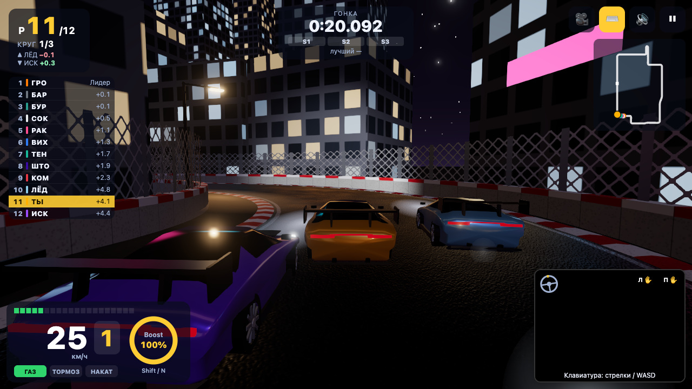
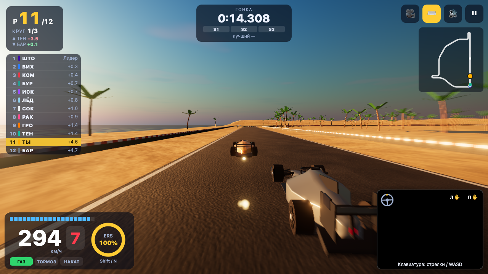
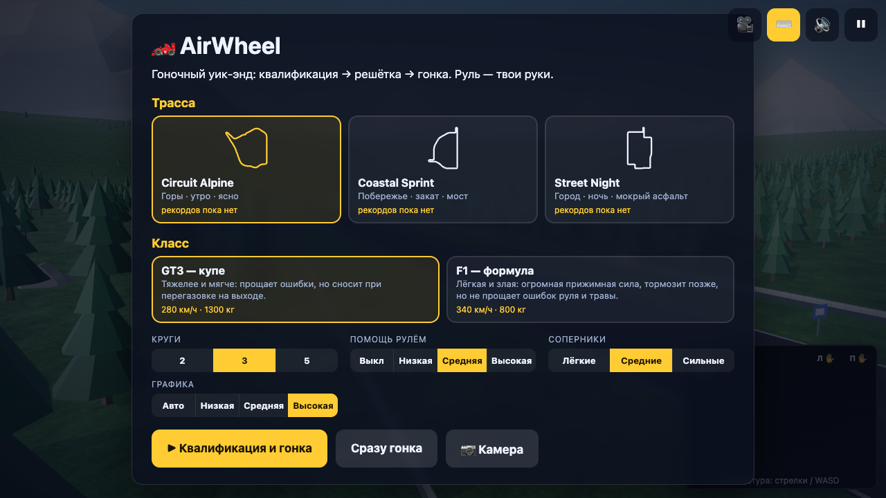
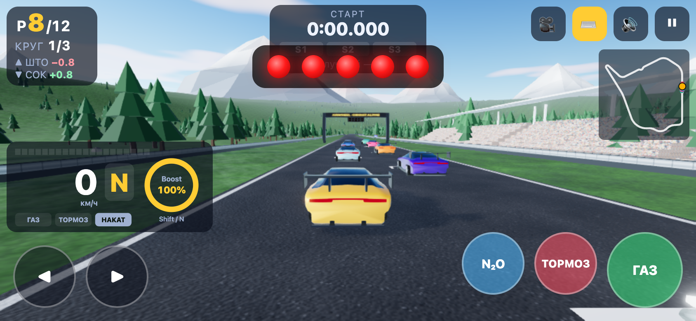

# 🏎️ AirWheel — руль из воздуха

3D-гонка с ботами, в которой машиной управляешь **руками через веб-камеру**, как настоящим рулём.
Гоночный уик-энд: квалификация → стартовая решётка → гонка на 12 машин → протокол и подиум.
Два класса (GT3 и F1), три трассы (горы днём, побережье на закате, город ночью).
Никаких контроллеров, установок и серверов: всё работает в браузере, все модели и текстуры генерируются кодом.

**Кейс:** «Motion. Камера вместо джойстика» · **Направление:** FREE / GAME


| Street Night — город ночью | Coastal Sprint — F1 на закате |
|---|---|
|  |  |
| **Меню уик-энда** | **Итоги и подиум** |
|  |  |
| **Онбординг: камера и свет → калибровка руля → обучение** | **Телефон: тач-кнопки** |
|  |  |

**Деплой:** _ссылка появится после публикации (см. раздел «Деплой»)_

---

## Как запустить локально

```bash
npm i          # заодно копирует WASM MediaPipe в public/wasm
npm run dev    # http://localhost:5173
```

```bash
npm run build    # сборка в dist/
npm run preview  # проверить сборку локально
npm test         # тесты распознавания, коуча, физики, трасс, ботов, квалификации и гонки
```

Камера в браузере работает только на `https://` или `localhost`. Без камеры можно играть с клавиатуры:
кнопка ⌨️ или клавиша `K`; при отказе камеры режим включается сам. На телефоне в клавиатурном режиме
появляются тач-кнопки (◀ ▶ ⚡ тормоз газ).

Параметры адреса для быстрой проверки: `?track=alpine|coastal|street`, `?class=gt3|f1`, `?laps=1`,
`?graphics=low|medium|high`, `?autopilot` — машину ведёт автопилот (для проверки без камеры).

---

## Жесты и действия

| Жест | Что показать | Действие |
|---|---|---|
| ✊✊ | Обе руки сжаты в кулаки | **Газ** (нарастает за 0,2 с) |
| ✋✋ | Обе ладони открыты | **Тормоз** (с ABS); стоя на месте > 0,6 с — задний ход |
| ✊✋ | Одна рука кулак, другая ладонь | **Накат** + подсказка |
| ↻ | Наклон линии между руками, как у руля | **Поворот** (±5° мёртвая зона, ±45° — максимум) |
| 👍 | Большой палец вверх на любой руке 0,3 с | **Boost** (GT3) / **ERS** (F1) |
| 🙌 | Обе открытые ладони подняты к камере 1 с | **Старт / продолжить** (меню, протокол квалы, пауза, итоги) |

Клавиатура: `↑`/`W` газ, `↓`/`S` тормоз, `←` `→`/`A` `D` руль, `Shift`/`N` ускорение, `C` камера,
`Esc`/`P` пауза, `M` звук, `K` камера/клавиатура, `` ` `` отладочная панель (FPS, draw calls, физика).

---

## Гоночный уик-энд

`МЕНЮ → КВАЛИФИКАЦИЯ → РЕШЁТКА → ГОНКА → ИТОГИ` ([`session.js`](src/game/session.js), [`quali.js`](src/game/quali.js))

1. **Меню** — трасса (с контуром и твоим рекордом), класс GT3/F1, 2/3/5 кругов, помощь рулём
   (выкл / низкая / средняя / высокая), сила соперников, пресет графики. Настройки сохраняются.
2. **Квалификация** — ты один на трассе, разгонный отрезок и **две попытки** быстрого круга подряд.
   Время, сектора S1/S2/S3 (фиолетовый — лучший у всех, зелёный — личный, жёлтый — медленнее),
   дельта к лучшему кругу в реальном времени. Боты получают времена заранее: их идеальный круг ±1,5%
   по «мастерству». Срезка аннулирует круг. Итог — протокол 1–12 и поул.
3. **Решётка** — пары со сдвигом по итогам квалы, панорама камеры, **5 красных огней**, случайная пауза,
   огни гаснут. Сдвинулся раньше — **фальстарт +5 с** (держи ладони раскрытыми, коуч подскажет).
4. **Гонка** — 12 машин, 3 круга по умолчанию. Позиция, круг, время, разрывы до соседей спереди и сзади,
   башня лидеров, мини-карта, лучший круг гонки, сообщения («Обгон!», «Лучший круг», «Удар о стену: +2 с»).
   Штрафы: удар о стену +2 с, **срезка** (все 4 колеса за линией трассы > 1 с) +3 с.
5. **Итоги** — протокол с временем/отставанием/лучшим кругом/штрафами, **очки 25-18-15-12-10-8-6-4-2-1**,
   сравнение «квала → финиш» (▲▼), 3D-подиум с машинами призёров, твои круги, ошибки коуча по типам
   и главная ошибка заезда. Кнопки «Ещё раз» и «Другая трасса». Рекорды (круг, квала, финиш)
   для каждой пары «трасса + класс» хранятся в `localStorage`.

---

## Классы машин

Файл [`src/game/cars.js`](src/game/cars.js) — только данные, физика и боты читают всё оттуда.

| | GT3 | F1 |
|---|---|---|
| Масса | 1300 кг | 800 кг |
| Мощность | ~404 кВт | ~750 кВт |
| Макс. скорость | ~280 км/ч | ~340 км/ч |
| Прижимная сила (∝ v²) | умеренная: +50% веса на максималке | ~3 веса на максималке |
| Сцепление шин | 1.32 | 1.55, жёсткие слики |
| Торможение | ~2 g | до ~5,5 g |
| Руль | мягче, запас задней оси больше | острее, запас меньше — строже к ошибкам |
| Трава | держит 42% | держит 30%, сильно тормозит |
| Передачи | 6 | 8 |
| Ускорение | Boost: +22% мощности 3 с, заряд со временем | ERS: +21% 4 с, заряд при торможении |

Разница ощущается: на Circuit Alpine автопилот едет круг на GT3 за ~69 с, на F1 — за ~53 с;
в быстрых поворотах F1 проходит на 30–60% быстрее, тормозной путь в шпильку короче на ~20%.
Модели процедурные ([`carModel.js`](src/render/carModel.js)): GT3 — кузов-«лофт» по сечениям, стёкла,
антикрыло, фары, диски; F1 — нос, монокок, понтоны, воздухозаборник, halo, антикрылья, подвеска, шлем.
Лак — `MeshPhysicalMaterial` с clearcoat, карбон — canvas-плетение.

---

## Трассы

Каждая трасса — данные ([`src/game/tracks/`](src/game/tracks)): раскладка «прямые + дуги» → замкнутый
сплайн CatmullRom, профили ширины, высоты, наклона и вылетов, повороты для зон торможения, окружение.
Генератор ([`trackMesh.js`](src/render/trackMesh.js), [`terrain.js`](src/render/terrain.js),
[`scenery.js`](src/render/scenery.js)) строит дорогу с UV и следами резины на траектории, поребрики,
ограждения (armco, шины, бетон с сеткой), рельеф, старт-финиш с порталом и огнями, разметку решётки,
тормозные таблички 100/50 м и DRS.

| Трасса | Длина | Характер |
|---|---|---|
| **Circuit Alpine** — горы, утро | 3,2 км, 12–14 м | длинные плавные дуги, подъём в эсках, самая длинная прямая вниз в **шпильку R19**, **шикана**, 90° T1; ельник, скалы, снежные вершины, трибуны у старта |
| **Coastal Sprint** — побережье, закат | 3,7 км, 12,5–15 м | прямая вдоль моря и **90° направо** после неё, быстрые дуги с наклоном, **две шпильки**, **мост над лагуной**; пальмы, дюны, низкое тёплое солнце, bloom |
| **Street Night** — город, ночь | 3,7 км, 8–11 м | узкие улицы, **бетонные стены вплотную**, **туннель**, **шпилька 180°**, семь поворотов 90° под тормоз, участок **~8 м** в старом городе, прямая вдоль набережной; здания со светящимися окнами, неон, фонари, мокрый асфальт |

На каждой трассе не меньше трёх поворотов, где надо тормозить: скорость в повороте считается по радиусу
траектории и прижимной силе, зона торможения — проходом назад по трассе (с учётом уклона и круга трения).

---

## Физика

[`physics.js`](src/game/physics.js), фиксированный шаг **120 Гц** отдельно от рендера, с интерполяцией.

- «Велосипедная» модель: продольная и боковая скорость, рыскание. Боковая сила шины насыщается:
  `|Fy| ≤ μ·(вес оси + прижимная сила)`, при превышении машина скользит — недоворот или снос.
- Перенос веса при разгоне/торможении, чувствительность шины к нагрузке, тяга с пробуксовкой
  (перегазовка «съедает» боковое сцепление задней оси — заметный снос), ABS/EBD, сопротивление воздуха ~v²,
  качению, уклон и наклон трассы.
- Покрытия под каждым колесом: асфальт 100%, поребрик 95% и вибрация (камера + звук), трава/песок
  ~40% и сильное замедление, стена — выталкивание, отскок, потеря скорости, искры.
- **Руль зависит от скорости**: угол колёс ограничен пределом сцепления плюс угол увода шины —
  иначе руками на скорости не проехать.
- **Помощь рулём** (по умолчанию «средняя»): мягкое удержание курса на прямых, доворот от края,
  подруливание против заноса, контроль тяги и ESP. Без помощи машина строже.
- Застрял или едешь не туда дольше 3–4 с — возврат на трассу.

## Боты

[`bots.js`](src/game/bots.js) — 11 соперников того же класса, без чит-скорости.

- Едут по **гоночной траектории** минимальной кривизны (снаружи — внутрь — наружу), рассчитанной заранее.
- Скорость в каждой точке — из собственного **профиля торможения/разгона**: мастерство 0,93–1,0 × сила
  соперников масштабирует скорость в поворотах, поэтому боты тормозят в тех же зонах, что и игрок.
- Характер: агрессивный или аккуратный — желание обгонять и частота ошибок (поздний тормоз, вынос наружу).
- Обгон на прямой, если сзади ближе 15 м; в поворотах и на узких участках — едут следом.
- Столкновения OBB с игроком: игрок теряет скорость, бот отскакивает. Резиновая связь ±5%.
- Кинематика вдоль трассы (дёшево), но с креном на поворотах, поворотом колёс и стоп-сигналами.

---

## Режим «Ошибка»

Файлы: [`coach.js`](src/control/coach.js) (правила и приоритеты), [`gestures.js`](src/control/gestures.js)
(ошибки рук), [`analyzer.js`](src/game/analyzer.js) (ошибки езды по данным трассы).

- **Одна подсказка за раз**, самая важная. Порядок: **безопасность → техника рук → освещение**.
- Подсказка держится минимум 1,5 с, но подсказка безопасности (стена, тормоз) вытесняет другую сразу.
- Проблемная рука на скелете в превью камеры красная. Статистика эпизодов → «главная ошибка заезда» в итогах.
- В клавиатурном режиме работают правила езды (с клавиатурными текстами).

| Приоритет | Ситуация | Подсказка |
|---|---|---|
| безопасность | Удар о стену | Ты задел стену. Держись ближе к центру трассы на узких участках. |
| | Через ~0,6 с скорость будет выше профиля торможения | Впереди шпилька (шикана, поворот 90°). Раскрой ладони и тормози сейчас. |
| | Газ, пока горят огни старта | Рано! Держи ладони раскрытыми, пока горят огни, — иначе фальстарт. |
| | В повороте с газом быстрее предела | Слишком быстро для поворота. Ладони раскрой раньше. |
| | Колёса на траве | Колёса на траве. Сбрось газ и вернись на асфальт плавно. |
| | Перед машины «уплыл», несёт наружу | Не довернул. Поверни руки сильнее и убери газ. |
| | Руль быстрее 2,4/с на скорости > 120 км/ч | Крутишь слишком резко на скорости. Поворачивай плавнее, иначе занос. |
| техника рук | Обе руки не видны (игра на паузе) | Обе руки пропали из кадра. Верни их в центр, на уровень груди. |
| | Одна рука не видна | Левая (правая) рука вышла из кадра. Верни её в центр. |
| | Запястье ниже 78% кадра | Руки слишком низко. Подними их на уровень груди, иначе руль не читается. |
| | Кулак + ладонь | Одна рука сжата, другая открыта. Сожми обе для газа или раскрой обе для тормоза. |
| | fist_score между 0,9 и 1,1 | Кулак сжат не до конца. Сожми крепче, чтобы газовать. |
| | Руки ближе 60% / дальше 160% калибровки | Руки слишком близко (далеко)… |
| | Угловая скорость руля > 250°/с | Крутишь слишком резко. Поворачивай плавнее. |
| | Руль 5–12° дольше 3 с на прямой | Руль уходит вбок. Выровняй руки по горизонтали. |
| | Тормоз на прямой без причины | Тормозишь на прямой. Сожми кулаки, чтобы ехать быстрее. |
| | Накат на свободной прямой | Газ не нажат на свободной прямой. Сожми оба кулака крепче. |
| | Палец вверх опущен раньше 0,3 с | Держи большой палец вверх дольше, пока не заполнится кольцо. |
| освещение | Яркость кадра < 55/255 | Слишком темно. Включи свет или повернись к окну. |

---

## Графика

- **Three.js**, один WebGL2-контекст (подиум рендерится им же). Нет WebGL2 — понятное сообщение и кнопка перезагрузки.
- Солнце с тенью, которая следует за машиной игрока; hemisphere-свет; процедурное небо `Sky` днём и
  шейдерное ночное небо со звёздами; environment map из неба через PMREM (ночью — с «огнями города»).
- Постобработка: Bloom, радиальное размытие на скорости, виньетка, ACES tone mapping, sRGB, FXAA/SMAA.
- Туман и дальность под каждую трассу. Деревья, камни, здания, фонари, стойки, трибуны — `InstancedMesh`,
  растительность разбита на чанки по 400 м с LOD; у машин LOD по расстоянию.
- Ночь: настоящие точечные огни только у 2–6 ближайших фонарей впереди, остальные — emissive + bloom;
  фара игрока — `SpotLight`, у ботов — светящиеся фары и пятна света на асфальте; мокрый асфальт отражает.
- Частицы: дым из-под колёс, искры (днище F1, стена), пыль и песок, брызги на мокром.
- Камеры: за машиной (динамический FOV, лёгкая тряска), капот/кокпит, ТВ-камеры у трассы — `C` или 🎥.
- **Пресеты** ([`quality.js`](src/render/quality.js)): Низкая (без теней и bloom, pixelRatio 1, меньше объектов),
  Средняя (тени 1024, bloom, FXAA), Высокая (тени 2048, bloom, SMAA, размытие). **Авто**: если средний FPS
  ниже 40 за 3 с, пресет понижается. Draw calls: ~90 на низком, ~160 на высоком (ночной город, 12 машин).
- Распознавание рук ограничено 30 Гц (24 Гц на низком пресете) и идёт только на новых кадрах камеры.

## Звук

Web Audio, без файлов ([`audio.js`](src/game/audio.js)): двигатель из двух осцилляторов и шума через
фильтр, частота — от оборотов и передачи (GT3 — низкий рык, F1 — высокий визг и турбо), провал на
переключениях, визг тормозов при ABS и шин в заносе, ветер, поребрик, удары и скрежет о стену,
ближайший соперник в стерео, сигналы огней старта, круга и финиша. Кнопка 🔊 / клавиша `M`.

---

## Как устроено распознавание

```
камера → HandLandmarker (21 точка × 2 руки) → gestures.js → {steer, gas, brake, nitro, handsVisible, fistL, fistR, errors[]} → игра
                                                  ↑ wheel.js (руль)      ↓ coach.js (подсказки) ← analyzer.js (ошибки езды)
```

Игровой слой (`src/game`) ничего не знает про MediaPipe: он получает только объект управления.
Клавиатура, тач-кнопки и автопилот отдают объект того же формата.

- **MediaPipe HandLandmarker** (`@mediapipe/tasks-vision`), 2 руки, режим `VIDEO`, GPU с откатом на CPU.
  WASM и модель лежат в `public/` и грузятся с того же домена, без CDN. `GestureRecognizer` **не используется**.
- **Зеркалирование** и разбор левой/правой руки по x на экране, а не по метке handedness.
- **Сжатие руки:** `fist_score` = среднее расстояние от кончиков 4 пальцев до запястья / размер ладони;
  гистерезис 0,9 / 1,1.
- **One Euro Filter** сглаживает запястья и угол руля. **Калибровка** — «возьми руль» и держи 2 с.
- **Потеря руки:** пропуски до 150 мс игнорируются; одна рука пропала — руль плавно в 0, газ выключен;
  пропали обе — пауза.

---

## Структура

```
public/             wasm MediaPipe, models/hand_landmarker.task
src/vision/         camera.js, hands.js, filters.js
src/control/        gestures.js, wheel.js, coach.js, keyboard.js
src/game/           cars.js, physics.js, track.js, profile.js (траектория, профиль скорости),
                    bots.js, session.js (гонка), quali.js, timing.js, analyzer.js, autopilot.js, audio.js
src/game/tracks/    alpine.js, coastal.js, street.js, turtle.js (раскладка), index.js
src/render/         scene.js (рендер, небо, постобработка), world.js, trackMesh.js, terrain.js, scenery.js,
                    carModel.js, cameras.js, particles.js, podium.js, quality.js, textures.js
src/ui/             hud.js, menu.js, results.js, onboarding.js, preview.js, leaderboard.js (рекорды)
src/main.js         стейт-машина уик-энда и главный цикл
tests/              coach.test.mjs (жесты и коуч), game.test.mjs (трассы, физика, боты, квала, гонка, графика)
```

## Тесты

`npm test` проверяет без браузера и камеры:
- распознавание жестов и все подсказки коуча на синтетических 21 точках руки, приоритеты и вытеснение;
- каждую трассу: замкнутость, ширину, ≥ 3 зоны торможения; особенности (шпильки, 90°, мост, туннель, 8 м);
- физику: макс. скорость GT3 ≈ 280 и F1 ≈ 340 км/ч, F1 быстрее в поворотах и тормозит позже;
- автопилот проходит круги без ударов близко к идеальному времени;
- анализ езды: «впереди шпилька», быстро в поворот, трава, тормоз и накат на прямой;
- ботов (2 круга без вылетов, обгоны), квалификацию (2 попытки, аннулирование круга), полную гонку
  (огни, финиш, протокол с очками), автоподбор графики.

---

## Деплой

Сборка статическая (`dist/`), бэкенд не нужен. Подготовлены конфиги для трёх площадок:

- **GitHub Pages:** запушить в `main`, в настройках репозитория выбрать *Pages → Source: GitHub Actions*.
  Workflow [`.github/workflows/deploy.yml`](.github/workflows/deploy.yml) прогонит тесты, соберёт и опубликует сайт.
- **Vercel:** импортировать репозиторий, настройки подтянутся из `vercel.json`.
- **Netlify:** импортировать репозиторий, настройки подтянутся из `netlify.toml`.

В `vite.config.js` стоит `base: './'`, поэтому сборка работает и в подпапке (`user.github.io/airwheel/`).

---

## Что было сделано до старта хакатона

Ничего. Весь код написан во время хакатона, это видно по истории коммитов.
Из готового используются только библиотеки `@mediapipe/tasks-vision` (детектор точек руки),
`three` (WebGL-рендер и постобработка из его примеров) и сборщик Vite.

---

## Известные ограничения

- Нужна веб-камера и **HTTPS** (или `localhost`), нормальный свет, руки должны помещаться в кадр (50–80 см от камеры).
- Нужен браузер с **WebGL2**. На встроенной графике игра сама понизит пресет; цель — 45+ FPS вместе
  с распознаванием рук. Первая загрузка около 20 МБ (WASM + модель), дальше — из кэша.
- Боты — кинематические (по траектории), а не полная физика: так дешевле для 11 машин.
- Помощь рулём по умолчанию включена: без неё машина заметно строже, особенно F1.
- Трава, песок и гравий по физике — одно покрытие «вне трассы».
- Режим «Ошибка» для жестов работает только с камерой; с клавиатуры коуч подсказывает только по езде.
