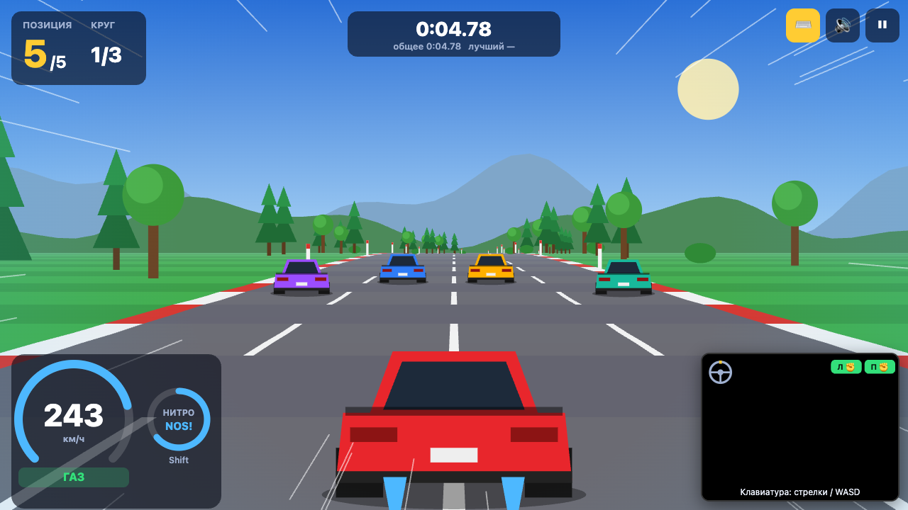
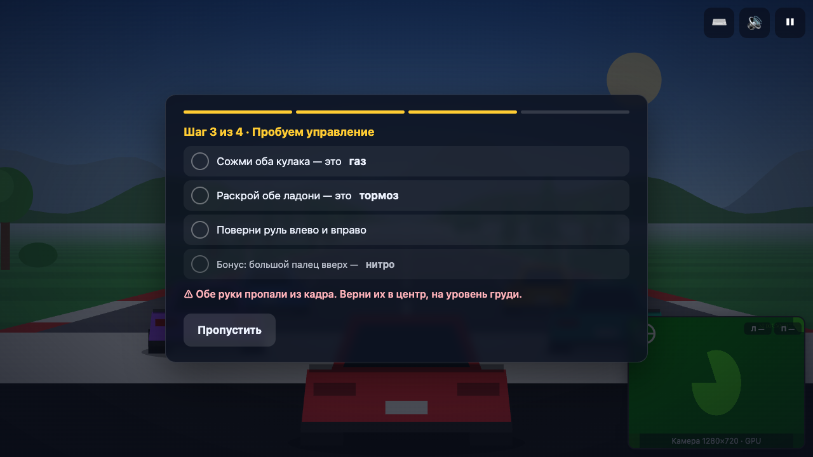

# 🏎️ AirWheel — руль из воздуха

Гонка с ботами, в которой машиной управляешь **руками через веб-камеру**, как настоящим рулём.
Никаких контроллеров, установок и серверов: всё работает в браузере.

**Кейс:** «Motion. Камера вместо джойстика» · **Направление:** FREE / GAME



| Онбординг | |
|---|---|
|  | Четыре экрана: камера и свет → «Возьми руль» (калибровка) → обучение с галочками → старт |

**Деплой:** _ссылка появится после публикации (см. раздел «Деплой»)_

---

## Как запустить локально

```bash
npm i          # заодно копирует WASM MediaPipe в public/wasm
npm run dev    # http://localhost:5173
```

Другие команды:

```bash
npm run build    # сборка в dist/
npm run preview  # проверить сборку локально
npm test         # тесты распознавания и режима «Ошибка» без камеры
```

Камера в браузере работает только на `https://` или `localhost`.
Для проверки с телефона в одной сети используй `npm run dev -- --host` и HTTPS-туннель (например, `ngrok http 5173`).

Без камеры можно играть с клавиатуры: кнопка ⌨️ или клавиша `K`. При отказе камеры режим включается сам.

---

## Жесты и действия

| Жест | Что показать | Действие |
|---|---|---|
| ✊✊ | Обе руки сжаты в кулаки | **Газ** |
| ✋✋ | Обе ладони открыты | **Тормоз** |
| ✊✋ | Одна рука кулак, другая ладонь | **Накат** (без газа и тормоза) + подсказка |
| ↻ | Наклон линии между руками, как у руля | **Поворот** (±5° мёртвая зона, ±45° — максимум) |
| 👍 | Большой палец вверх на любой руке 0,3 с | **Нитро** на 2 с, затем откат 8 с |
| 🙌 | Обе открытые ладони подняты к камере 1 с | **Старт / продолжить** (в меню, на паузе и в итогах) |

Клавиатура: `↑`/`W` газ, `↓`/`S` тормоз, `←` `→`/`A` `D` руль, `Shift`/`N` нитро, `Esc`/`P` пауза, `M` звук, `K` камера/клавиатура, `` ` `` отладочная панель.
На телефоне в клавиатурном режиме появляются тач-кнопки.

---

## Режим «Ошибка»

Файл: [`src/control/coach.js`](src/control/coach.js).

Распознавание ([`gestures.js`](src/control/gestures.js)) каждый кадр выдаёт список «сырых» проблем `errors[]`.
Коуч превращает их в понятные подсказки по правилам:

- **Одна подсказка за раз.** Из активных выбирается самая важная (по приоритету).
- **Без мигания.** Подсказка держится минимум **1,5 с**, у каждого правила есть задержка срабатывания,
  чтобы не ругаться на один случайный кадр. Импульсные ошибки (рывок руля, короткое нитро) «залипают» на время.
- **Подсветка.** Проблемная рука на скелете в превью камеры красная, остальные — зелёные.
  Если проблема в обеих руках (расстояние, крен, рывок), красным становится и линия руля.
- **Статистика.** За заезд считается число эпизодов каждой ошибки. В итогах показаны ошибки по типам
  и **главная ошибка заезда** с советом, как её исправить.
- Если пропали **обе** руки, игра встаёт на паузу с подсказкой. Продолжить можно, подняв обе открытые ладони.

### Все подсказки

| Приоритет | Условие | Подсказка |
|---|---|---|
| 1 | Средняя яркость кадра < 55/255 (замер раз в секунду) | Слишком темно. Включи свет или повернись к окну. |
| 2 | Обе руки не видны > 0,2 с (игра на паузе) | Обе руки пропали из кадра. Верни их в центр, на уровень груди. |
| 3 | Одна рука не видна > 0,2 с | Левая (правая) рука вышла из кадра. Верни её в центр. |
| 4 | Запястье ниже 78% высоты кадра > 0,6 с | Руки слишком низко. Подними их на уровень груди, иначе руль не читается. |
| 5 | Одна рука кулак, другая ладонь > 0,4 с | Одна рука сжата, другая открыта. Сожми обе для газа или раскрой обе для тормоза. |
| 6 | fist_score между 0,9 и 1,1 дольше 0,5 с | Кулак сжат не до конца. Сожми крепче, чтобы газовать. |
| 7 | Расстояние между запястьями < 60% от калибровки > 0,7 с | Руки слишком близко. Разведи шире, руль будет точнее. |
| 7 | Расстояние между запястьями > 160% от калибровки > 0,7 с | Руки слишком далеко друг от друга. Сведи ближе. |
| 8 | Угловая скорость руля > 250°/с | Крутишь слишком резко. Поворачивай плавнее. |
| 9 | Угол руля 5–12° дольше 3 с на прямом участке | Руль уходит вбок. Выровняй руки по горизонтали. |
| 10 | Палец вверх замечен, но опущен раньше 0,3 с | Держи большой палец вверх дольше, пока не заполнится кольцо. |

Если «открытая» рука на самом деле в промежуточной зоне fist_score, показывается подсказка про недожатый
кулак, а не про смешанные жесты: настоящая причина — слабый кулак.

Все правила проверяются автоматически в `npm test`: тест генерирует синтетические 21 точку руки
(кулак, ладонь, полукулак, палец вверх, наклоны, рывки, потеря руки, тёмный кадр) и проверяет,
что каждая подсказка срабатывает, а на «чистых» руках нет ни одной.

---

## Как устроено распознавание

```
камера → HandLandmarker (21 точка × 2 руки) → gestures.js → {steer, gas, brake, nitro, handsVisible, fistL, fistR, errors[]} → игра
                                                  ↑ wheel.js (руль)      ↓ coach.js (подсказки)
```

Игровой слой (`src/game`) ничего не знает про MediaPipe: он получает только объект управления.
Клавиатура ([`keyboard.js`](src/control/keyboard.js)) отдаёт объект того же формата, поэтому к модулю
управления можно подключить любую другую игру.

- **MediaPipe HandLandmarker** (`@mediapipe/tasks-vision`), 2 руки, режим `VIDEO`, GPU с откатом на CPU.
  WASM и модель `hand_landmarker.task` лежат в `public/` и грузятся с того же домена, без CDN.
  Готовый `GestureRecognizer` **не используется**: вся классификация своя.
- **Зеркалирование.** Координаты сразу зеркалятся (`x = 1 − x`), левая/правая рука определяется **по x на экране**,
  а не по метке handedness: у фронтальной камеры она часто путается. Если видна одна рука, она
  привязывается к ближайшему слоту по прошлой позиции.
- **Сжатие руки.** `fist_score` = среднее расстояние от кончиков 4 пальцев (8, 12, 16, 20) до запястья (0),
  делённое на размер ладони (0–9). Расстояния считаются с поправкой на соотношение сторон кадра.
- **Гистерезис.** Кулак при `fist_score < 0.9`, ладонь при `> 1.1`, между ними сохраняется прежнее состояние,
  поэтому на границе ничего не дребезжит.
- **Большой палец вверх.** Кончик 4 выше сустава 3 и основания указательного 5 (с запасом в долях ладони),
  выше запястья, а остальные пальцы согнуты.
- **One Euro Filter** ([`filters.js`](src/vision/filters.js)) сглаживает координаты запястий и угол руля.
  При медленном движении он сильно гасит дрожание, при быстром уменьшает задержку.
- **Руль.** Угол = `atan2(dy, dx)` между запястьями, минус нулевой угол калибровки, мёртвая зона ±5°,
  максимум ±45°, на выходе `steer ∈ [−1, 1]`.
- **Калибровка.** Игрок «берёт руль» и держит 2 секунды. Если руки дёрнулись (> 12° или > 25% по расстоянию),
  отсчёт начинается заново. Сохраняются нулевой угол (среднее через sin/cos) и базовое расстояние между руками.
- **Потеря руки.** Короткие пропуски трекинга до 150 мс игнорируются. Если одна рука пропала, руль плавно
  возвращается в 0 за 0,5 с, а газ отключается. Если пропали обе, игра встаёт на паузу.
- **Производительность.** Инференс идёт в `requestAnimationFrame` и только на новом кадре камеры.
  Симуляция игры работает отдельно, с фиксированным шагом 1/60 с. Если FPS держится ниже 24,
  нагрузка снижается по шагам: видео 640×480 → меньше пикселей canvas → детект через кадр.

---

## Игра

- Псевдо-3D дорога из сегментов с поворотами, холмами, туманом и параллаксом гор.
  Все спрайты (машины, деревья, знаки, ворота) рисуются кодом, внешних ассетов нет.
- Одна трасса, 3 круга, обратный отсчёт 3-2-1, финиш.
- Физика: разгон, торможение, накат, центробежный снос пропорционально скорости и кривизне,
  замедление на обочине, удары о деревья и столбы.
- **4 бота** со своей максимальной скоростью (86–100% от игрока), своей полосой и лёгким вилянием.
  Притормаживают перед крутыми поворотами, перестраиваются, если впереди медленная машина.
  Резиновая связь меняет их скорость в пределах ±10%. При столкновении игрок теряет скорость,
  звучит удар и трясётся камера.
- HUD: позиция 1/5…5/5, круг, время круга, общее и лучшее время, спидометр, индикатор газ/тормоз/накат,
  кольцо нитро (заполнение удержанием → действие → откат), подсказка коуча.
- Звук через Web Audio API, без файлов: двигатель (высота зависит от скорости), визг тормозов,
  нитро, удар, сигналы старта, круга и финиша. Кнопка mute.
- Эффекты: тряска при ударе, линии скорости и голубая виньетка при нитро, дым при торможении, пыль на обочине.
- Итоги: место, время, лучший круг, ошибки по типам, главная ошибка с советом, «Ещё раз».
  Таблица рекордов (топ-5) хранится в `localStorage`.
- Телефон: ландшафтная ориентация (в портретной просим повернуть), фронтальная камера,
  canvas на весь экран, крупные кнопки.

---

## Структура

```
public/            wasm MediaPipe, models/hand_landmarker.task
src/vision/        camera.js, hands.js, filters.js
src/control/       gestures.js, wheel.js, coach.js, keyboard.js
src/game/          track.js, renderer.js, physics.js, bots.js, hud.js, audio.js, effects.js
src/ui/            onboarding.js, results.js, leaderboard.js, preview.js
src/main.js        стейт-машина и главный цикл
tests/             тесты распознавания и коуча на синтетических руках
```

---

## Деплой

Сборка статическая (`dist/`), бэкенд не нужен. Подготовлены конфиги для трёх площадок:

- **GitHub Pages:** запушить в `main`, в настройках репозитория выбрать *Pages → Source: GitHub Actions*.
  Workflow [`.github/workflows/deploy.yml`](.github/workflows/deploy.yml) прогонит тесты, соберёт и опубликует сайт.
- **Vercel:** импортировать репозиторий, настройки подтянутся из `vercel.json`.
- **Netlify:** импортировать репозиторий, настройки подтянутся из `netlify.toml`.

В `vite.config.js` стоит `base: './'`, поэтому сборка работает и в подпапке (`user.github.io/airwheel/`).

---

## Что было сделано до старта хакатона

Ничего. Весь код написан во время хакатона, это видно по истории коммитов.
Из готового используются только библиотека `@mediapipe/tasks-vision` (детектор точек руки) и сборщик Vite.

---

## Известные ограничения

- Нужна веб-камера и **HTTPS** (или `localhost`): иначе браузер не даст доступ к камере.
- Нужен **нормальный свет**. В темноте точки руки распознаются хуже, об этом предупредит коуч.
- Руки должны помещаться в кадр: лучше сесть в 50–80 см от камеры.
- Первая загрузка около 20 МБ (WASM + модель). Дальше файлы берутся из кэша браузера.
- На слабых телефонах FPS может быть ниже 30, тогда игра автоматически снижает качество.
- Режим «Ошибка» работает только с камерой. В клавиатурном режиме статистика ошибок не собирается.
